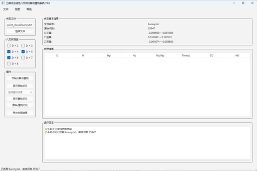
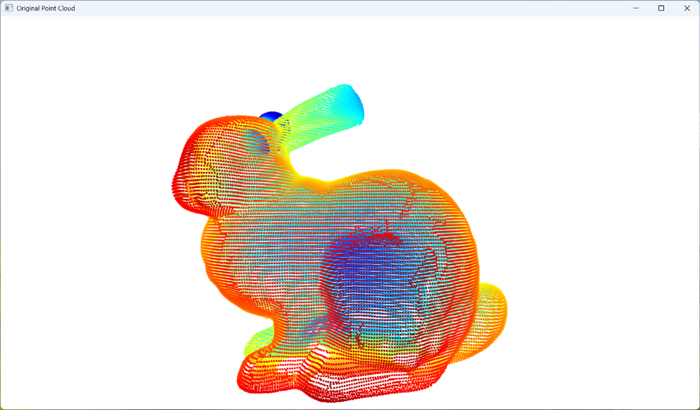
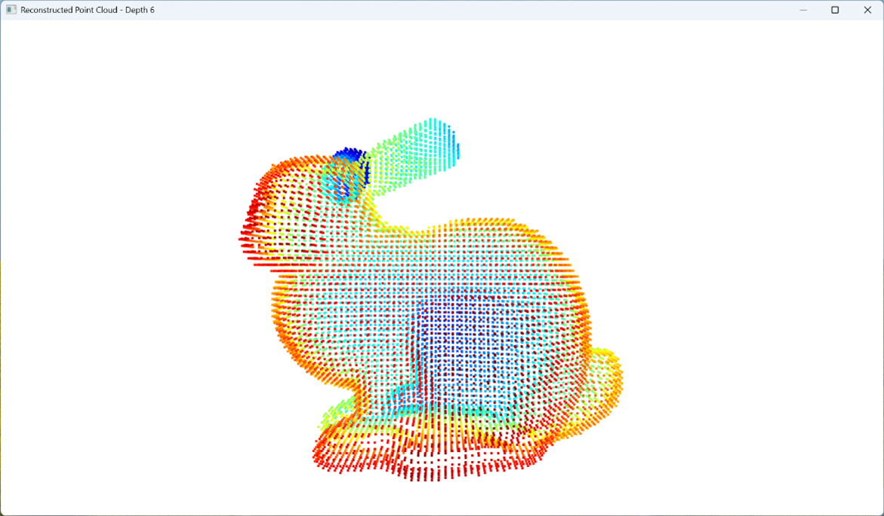
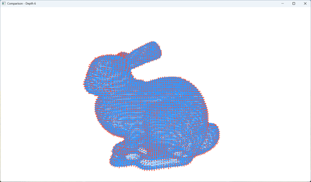

# 三维点云线性八叉树分解与重构系统

**Linear Octree Point Cloud Decomposition and Reconstruction System**

## 项目概述

程序以三维点云 XYZ 坐标为输入，根据设定的八叉树深度对点云空间进行体素划分，并将占用体素转换为八叉树路径。
在完整路径的基础上，将具有相同前缀的末级节点进行合并，使用“路径前缀 + 8 位末级占用状态”记录空间占用信息。随后根据编码结果恢复完整路径，并利用占用体素中心生成重构点云。
系统支持不同八叉树深度下的批量处理，并使用 Chamfer Distance（CD）和 Hausdorff Distance（HD）评价重构结果。

## 功能

- TXT 点云数据读取
- 点云归一化与体素划分
- 线性八叉树路径编码
- 路径前缀与末级占用状态表示
- 点云重构
- 多八叉树深度批量处理
- Chamfer Distance（CD）计算
- Hausdorff Distance（HD）计算
- 原始点云与重构点云可视化
- 处理结果导出

## 环境

- Python 3.12
- NumPy
- SciPy
- Open3D
- PySide6

## 运行界面

  

## 点云可视化

### 原始点云

  

### 重构点云

  

### 原始点云与重构点云对比

  

## 使用文档

完整的软件安装、界面功能、点云加载、参数设置、分解与重构、三维可视化、结果导出以及常见问题处理，请参阅：

**[用户操作手册](docs/user_manual.pdf)**

## Author

Fan Chuanhua